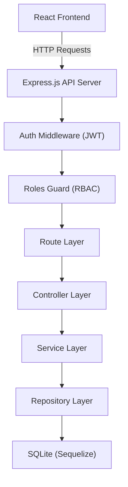
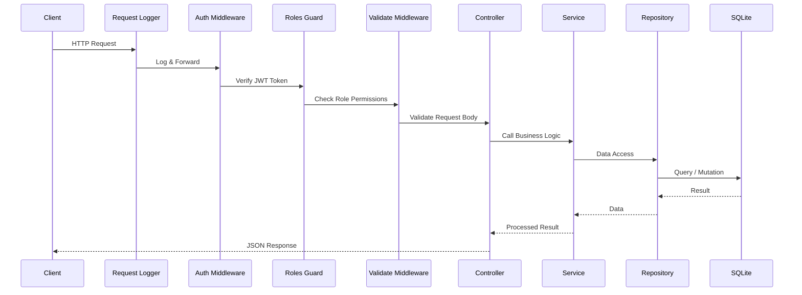
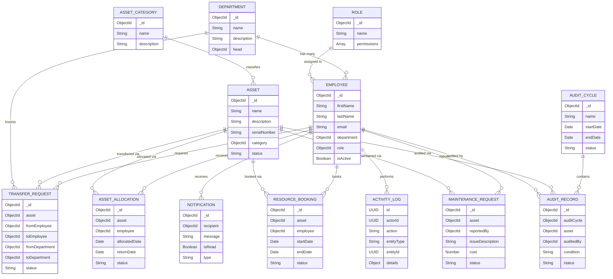
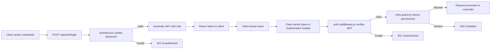
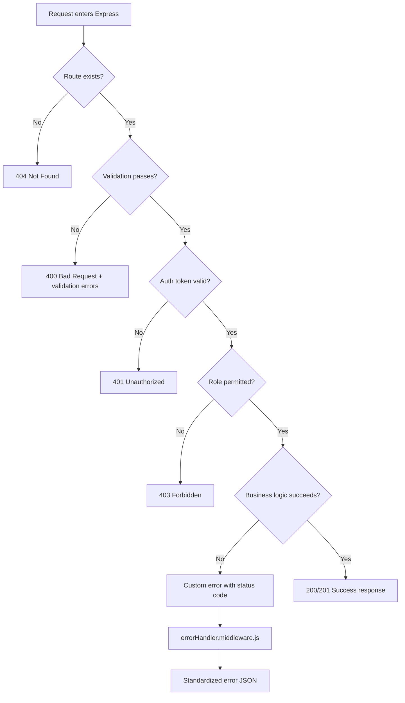

# AssetFlow — System Design Document

## 1. Overview

**AssetFlow** is an Enterprise Asset & Resource Management System built on the MERN stack. It enables organizations to track, allocate, book, maintain, and audit their physical and digital assets across departments.

---

## 2. High-Level Architecture



---

## 3. Request Lifecycle

Every incoming API request flows through a predictable pipeline:



---

## 4. Folder Structure & Layer Responsibilities

```
backend/
├── src/
│   ├── config/         → Environment variables, DB URI, JWT secret
│   ├── database/       → Mongoose connection setup
│   ├── auth/           → JWT verification, Role-based access guard
│   ├── middleware/      → Error handler, Request logger, Validation
│   ├── models/         → Mongoose schemas for all domain entities
│   ├── routes/         → Express routers mapping URLs to controllers
│   ├── controllers/    → HTTP request handlers (no business logic)
│   ├── services/       → Business logic layer
│   ├── repositories/   → Data access abstraction over Mongoose
│   ├── validations/    → Request payload schemas
│   ├── constants/      → Roles, error codes, messages
│   ├── helpers/        → Standardized response format
│   ├── utils/          → Date, crypto, and generic utilities
│   ├── app.js          → Express app setup (cors, json, middlewares)
│   └── server.js       → Entry point (connect DB, start server)
└── package.json
```

| Layer | Responsibility | Rule |
|-------|---------------|------|
| **Routes** | Map URL paths to controllers | No logic here |
| **Controllers** | Parse request, call service, send response | No DB queries |
| **Services** | Business rules and orchestration | No HTTP awareness |
| **Repositories** | Raw data access (find, create, update, delete) | No business rules |
| **Models** | Define data shape and relationships | Schema only |

---

## 5. Entity Relationship Diagram



---

## 6. Authentication & Authorization Flow



### Supported Roles

| Role | Description |
|------|-------------|
| **Admin** | Full system access. Manages users, assets, and all configurations. |
| **Asset Manager** | Manages asset lifecycle — allocation, transfers, maintenance, audits. |
| **Department Head** | Manages department-level asset requests and approvals. |
| **Employee** | Can view allocated assets, request bookings, and report issues. |

---

## 7. API Design Overview

All APIs follow RESTful conventions and return a standardized JSON format:

```json
{
  "success": true,
  "message": "Description of result",
  "data": {}
}
```

### Core API Groups

| Group | Base Path | Description |
|-------|-----------|-------------|
| Auth | `/api/auth` | Login, register, token refresh |
| Departments | `/api/departments` | CRUD for departments |
| Employees | `/api/employees` | CRUD for employees |
| Assets | `/api/assets` | CRUD for assets |
| Asset Categories | `/api/asset-categories` | CRUD for asset categories |
| Allocations | `/api/allocations` | Asset allocation records |
| Transfers | `/api/transfers` | Transfer requests |
| Bookings | `/api/bookings` | Resource booking |
| Maintenance | `/api/maintenance` | Maintenance requests |
| Audits | `/api/audits` | Audit cycles and records |
| Notifications | `/api/notifications` | User notifications |
| Activity Logs | `/api/activity-logs` | System activity trail |

---

## 8. Error Handling Strategy



All errors are caught by the global `errorHandler.middleware.js` and returned in a consistent format:

```json
{
  "success": false,
  "message": "Error description",
  "errors": null
}
```

In development mode, the stack trace is included in the `errors` field for debugging.

---

## 9. Technology Stack Summary

| Component | Technology |
|-----------|------------|
| Runtime | Node.js |
| Framework | Express.js |
| Database | SQLite |
| ORM | Sequelize |
| Auth | JWT (jsonwebtoken) |
| Validation | Zod (or manual) |
| CORS | cors package |
| Environment | dotenv |
| Frontend | React (separate module) |

---

## 10. How to Extend (For Teammates)

To add a new feature module (e.g., "Maintenance Workflows"):

1. Write the business logic in `src/services/maintenance.service.js`
2. Create the controller in `src/controllers/maintenance.controller.js`
3. Add validation schemas in `src/validations/maintenance.validation.js`
4. Define routes in `src/routes/maintenance.routes.js`
5. Register the routes in `src/routes/index.js`
6. The model (`maintenanceRequest.model.js`) is already provided

**Do NOT modify**: `app.js`, `server.js`, `connection.js`, `env.config.js`, or any middleware files unless absolutely necessary. These are shared infrastructure.
