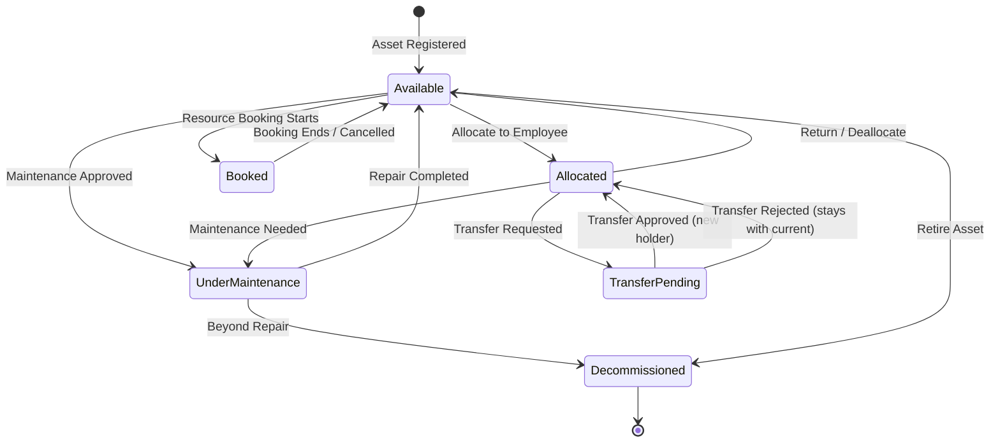

# Module 03 — Asset Management

## Overview
Central module for registering, tracking, and managing the lifecycle of all organizational assets. The **Asset** entity is the core of the entire system — every other module references it.

---

## Entity: Asset

```
{
  _id:          ObjectId,
  name:         String (required),
  description:  String,
  serialNumber: String (required, unique),
  category:     ObjectId → AssetCategory,
  status:       String (default: 'Available')
}
```
Ref: [asset.model.js](file:///c:/Users/DELL/Desktop/odoo-hackseye-hackathon/backend/src/models/asset.model.js)

### Schema Enhancements Recommended

```diff
 const assetSchema = new mongoose.Schema({
   name: { type: String, required: true },
   description: { type: String },
   serialNumber: { type: String, unique: true, required: true },
   category: { type: mongoose.Schema.Types.ObjectId, ref: 'AssetCategory' },
   status: { type: String, default: 'Available' },
+  department: { type: mongoose.Schema.Types.ObjectId, ref: 'Department' },
+  location: { type: String },
+  purchaseDate: { type: Date },
+  purchaseCost: { type: Number },
+  condition: { type: String, default: 'Good' },
+  isBookable: { type: Boolean, default: false },
+  qrCode: { type: String, unique: true, sparse: true }
 }, { timestamps: true });
```

- `department`: Which department owns/controls this asset
- `location`: Physical location (building, room, etc.)
- `isBookable`: Whether this asset can be booked as a shared resource (rooms, vehicles, projectors)
- `qrCode`: Generated unique QR identifier for audit scanning
- `condition`: `Good | Fair | Poor | Damaged | Not Found`

---

## Asset Lifecycle — State Machine



### Valid Status Values
| Status | Description |
|--------|-------------|
| `Available` | In inventory, ready for allocation or booking |
| `Allocated` | Assigned to a specific employee |
| `Under Maintenance` | Pulled for repair or servicing |
| `Booked` | Temporarily reserved via resource booking |
| `Transfer Pending` | Allocation transfer in progress |
| `Decommissioned` | End of life, no longer in use |

---

## Business Rules

### BR-ASSET-01: Register Asset
1. Accept: `name`, `description`, `serialNumber`, `category`, `department`, `location`, `purchaseDate`, `purchaseCost`, `isBookable`
2. Validate `serialNumber` is unique → 409 if duplicate
3. Validate `category` exists → 400 if not found
4. If `department` provided, validate it exists
5. Auto-generate `qrCode` = `AF-{serialNumber}-{shortId}` (or UUID)
6. Set `status = 'Available'`, `condition = 'Good'`
7. **Log Activity**: `ASSET_REGISTERED`
8. Return the created asset

### BR-ASSET-02: Update Asset
1. Admin or Asset Manager can update metadata fields: `name`, `description`, `category`, `department`, `location`, `isBookable`
2. **Cannot change**: `serialNumber` (immutable after creation)
3. **Cannot directly change**: `status` — status is driven by business events (allocation, maintenance, etc.)
4. Validate foreign key references exist
5. **Log Activity**: `ASSET_UPDATED`

### BR-ASSET-03: Update Asset Condition
1. Accept: `condition` (Good / Fair / Poor / Damaged)
2. This is separate from status — an asset can be "Allocated" with condition "Fair"
3. If condition is set to `Damaged`, auto-create a Maintenance Request suggestion notification to Asset Manager
4. **Log Activity**: `ASSET_CONDITION_UPDATED`

### BR-ASSET-04: Decommission Asset
1. Only if status is `Available` or `Under Maintenance`
2. **Cannot decommission** if currently `Allocated` — must return first
3. **Cannot decommission** if currently `Booked` — must cancel booking first
4. Set `status = 'Decommissioned'`
5. **Log Activity**: `ASSET_DECOMMISSIONED`
6. **Notify**: Admin + Asset Manager

### BR-ASSET-05: List Assets (Directory)
1. Return paginated list with populated `category` and `department`
2. Filters:
   - `status` (multi-select)
   - `category` (ObjectId)
   - `department` (ObjectId)
   - `condition` (multi-select)
   - `isBookable` (boolean)
3. Search: text search across `name`, `serialNumber`, `description`
4. Sort: by `name`, `createdAt`, `status`, `category`

### BR-ASSET-06: Get Asset by ID
1. Return full asset with populated references
2. Include **related data** (optional query params to include):
   - Current allocation (if status = Allocated)
   - Allocation history
   - Maintenance history
   - Booking history
   - Audit records
3. 404 if not found

### BR-ASSET-07: Get Asset by QR Code / Serial Number
1. Accept: `serialNumber` or `qrCode` as query param
2. Return full asset with current allocation details
3. Used by the audit module for QR scanning verification

### BR-ASSET-08: Bulk Import (Future)
1. Accept CSV/JSON array of assets
2. Validate each row
3. Skip duplicates (by serialNumber)
4. Return import summary: `{ created, skipped, errors }`

---

## API Endpoints

| Method | Path | Roles | Description |
|--------|------|-------|-------------|
| `POST` | `/api/assets` | Admin, Asset Manager | Register new asset |
| `GET` | `/api/assets` | Admin, Asset Manager, Dept Head, Employee | List/search assets |
| `GET` | `/api/assets/:id` | Admin, Asset Manager, Dept Head, Employee | Get by ID |
| `GET` | `/api/assets/lookup` | Admin, Asset Manager | Find by serial/QR |
| `PUT` | `/api/assets/:id` | Admin, Asset Manager | Update metadata |
| `PATCH` | `/api/assets/:id/condition` | Admin, Asset Manager | Update condition |
| `PATCH` | `/api/assets/:id/decommission` | Admin | Decommission |

---

## Validation Schema

### Create Asset
```
{
  name:          z.string().min(2).max(200),
  description:   z.string().max(1000).optional(),
  serialNumber:  z.string().min(1).max(100),
  category:      z.string(),              // ObjectId
  department:    z.string().optional(),    // ObjectId
  location:      z.string().max(200).optional(),
  purchaseDate:  z.string().datetime().optional(),
  purchaseCost:  z.number().min(0).optional(),
  isBookable:    z.boolean().optional()
}
```

### Update Condition
```
{
  condition: z.enum(['Good', 'Fair', 'Poor', 'Damaged'])
}
```

---

## Data Access Patterns

| Query | Index Recommendation |
|-------|---------------------|
| Find by serialNumber | Already `unique: true` |
| Find by status | `{ status: 1 }` |
| Find by category | `{ category: 1 }` |
| Find by department | `{ department: 1 }` |
| Text search | `{ name: 'text', description: 'text', serialNumber: 'text' }` |
