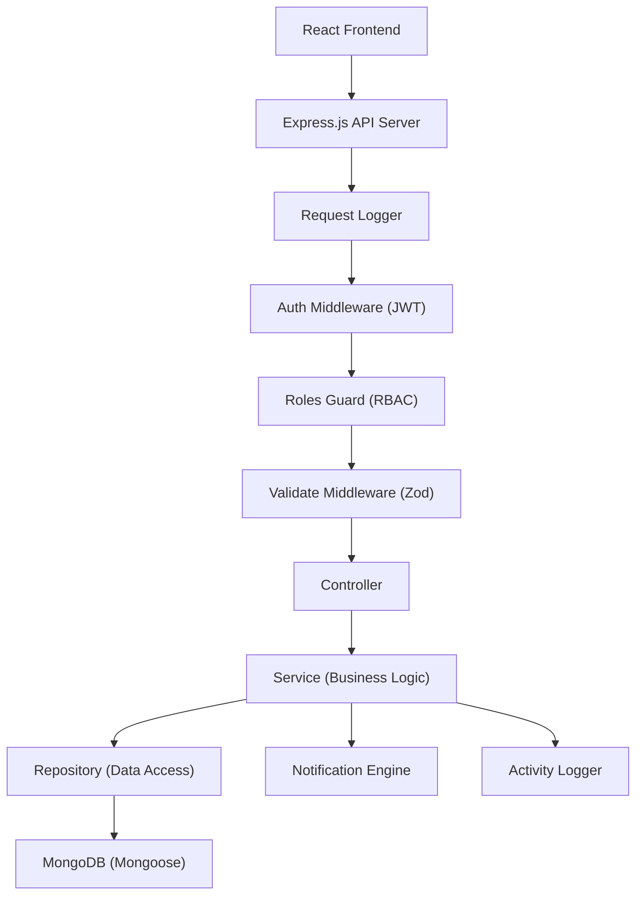

# AssetFlow — Business Logic Overview

> **Source of truth**: Codebase analysis + [Excalidraw Wireframes](https://app.excalidraw.com/l/65VNwvy7c4X/5ceOBMjbDby)

---

## 1. Codebase State Summary

### What EXISTS (Implemented)

| Layer | Files | Status |
|-------|-------|--------|
| **Express App** | [app.js](file:///c:/Users/DELL/Desktop/odoo-hackseye-hackathon/backend/src/app.js) | ✅ CORS, JSON parsing, health check, error handler mounted |
| **Server Entry** | [server.js](file:///c:/Users/DELL/Desktop/odoo-hackseye-hackathon/backend/src/server.js) | ✅ DB connect + listen |
| **DB Connection** | [connection.js](file:///c:/Users/DELL/Desktop/odoo-hackseye-hackathon/backend/src/database/connection.js) | ✅ Mongoose connect |
| **Config** | [env.config.js](file:///c:/Users/DELL/Desktop/odoo-hackseye-hackathon/backend/src/config/env.config.js) | ✅ PORT, MONGO_URI, JWT_SECRET, NODE_ENV |
| **Auth Middleware** | [auth.middleware.js](file:///c:/Users/DELL/Desktop/odoo-hackseye-hackathon/backend/src/auth/auth.middleware.js) | ✅ JWT verify, attaches `req.user` |
| **Roles Guard** | [roles.guard.js](file:///c:/Users/DELL/Desktop/odoo-hackseye-hackathon/backend/src/auth/roles.guard.js) | ✅ Role-based check against `req.user.role` |
| **Error Handler** | [errorHandler.middleware.js](file:///c:/Users/DELL/Desktop/odoo-hackseye-hackathon/backend/src/middleware/errorHandler.middleware.js) | ✅ Global error catcher, dev stack traces |
| **Request Logger** | [requestLogger.middleware.js](file:///c:/Users/DELL/Desktop/odoo-hackseye-hackathon/backend/src/middleware/requestLogger.middleware.js) | ✅ Console log `[timestamp] METHOD /path` |
| **Validation MW** | [validate.middleware.js](file:///c:/Users/DELL/Desktop/odoo-hackseye-hackathon/backend/src/middleware/validate.middleware.js) | ✅ Zod `schema.parse()` on `req.body` |
| **Response Helper** | [response.helper.js](file:///c:/Users/DELL/Desktop/odoo-hackseye-hackathon/backend/src/helpers/response.helper.js) | ✅ `sendSuccess()` / `sendError()` |
| **13 Mongoose Models** | `src/models/*.model.js` | ✅ Schema definitions with refs |

### What's EMPTY (Placeholder files — 0 bytes)

| Layer | Empty Files |
|-------|-------------|
| **Routes** | `index.js`, `auth.routes.js`, `asset.routes.js` |
| **Controllers** | `auth.controller.js`, `asset.controller.js` |
| **Services** | `auth.service.js`, `asset.service.js` |
| **Repositories** | `base.repository.js`, `asset.repository.js` |
| **Validations** | `auth.validation.js`, `asset.validation.js` |
| **Constants** | `roles.constants.js`, `errorCodes.constants.js`, `messages.constants.js` |
| **Utils** | `crypto.util.js`, `date.util.js` |

> [!IMPORTANT]
> The entire business logic layer is **unimplemented**. Only the infrastructure skeleton and Mongoose schemas exist. All routes, controllers, services, repositories, validations, constants, and utils are empty files.

### Missing Module Files (Not yet created)

Based on the wireframes and system design, the following modules need new files across all layers:

- **Organization Setup**: `department`, `employee`, `assetCategory`, `role`
- **Allocation & Transfer**: `allocation`, `transfer`
- **Resource Booking**: `booking`
- **Maintenance**: `maintenance`
- **Audit**: `audit`
- **Notifications**: `notification`
- **Activity Logs**: `activityLog`
- **Reports & Analytics**: `report`

---

## 2. Excalidraw Wireframe Summary (10 Screens)

The wireframe defines the full user-facing scope of the application:

| Screen | Title | Purpose |
|--------|-------|---------|
| 1 | **Login** | Email/password auth. Sign-up creates an Employee account (Admin assigns roles later) |
| 2 | **Dashboard** | KPI cards (available/allocated/bookings/transfers/returns), overdue alerts, quick actions, recent activity feed |
| 3 | **Organization Setup** | Admin-only. Tabs: Departments, Categories, Employees. Drives dropdowns across other screens |
| 4 | **Asset Registration & Directory** | Search (name/serial/QR), filters, asset table with tag, category, status, location |
| 5 | **Allocation & Transfer** | Double-allocation prevention block, transfer request form, allocation history trail |
| 6 | **Resource Booking** | Calendar timeline for shared resources, conflict detection, slot booking |
| 7 | **Maintenance Management** | Kanban board: Pending → Approved → Technician Assigned → In Progress → Resolved |
| 8 | **Asset Audit** | QR-based verification, discrepancy auto-flagging (Missing/Damaged), audit cycle close |
| 9 | **Reports & Analytics** | Utilization by dept, maintenance frequency, most-used/idle assets, retirement alerts |
| 10 | **Activity Logs & Notifications** | Real-time event feed, filterable by category (Alerts/Approvals/Bookings) |

---

## 3. System Architecture



### Layer Separation Rules

| Layer | Does | Does NOT |
|-------|------|----------|
| **Route** | Maps URL → middleware chain → controller | Contain logic |
| **Controller** | Parses `req`, calls service, returns `res` via helper | Query DB directly |
| **Service** | Orchestrates business rules, validation, state transitions | Know about HTTP (req/res) |
| **Repository** | CRUD abstraction over Mongoose | Contain business rules |
| **Model** | Defines schema shape + indexes | Contain queries or logic |

---

## 4. RBAC — Role-Based Access Control Matrix

Four roles defined in the README and wireframes:

| Action | Admin | Asset Manager | Dept Head | Employee |
|--------|:-----:|:-------------:|:---------:|:--------:|
| **Organization Setup** (Dept/Category/Employee CRUD) | ✅ | ❌ | ❌ | ❌ |
| **Assign Roles** | ✅ | ❌ | ❌ | ❌ |
| **Register Asset** | ✅ | ✅ | ❌ | ❌ |
| **View All Assets** | ✅ | ✅ | ✅ (dept only) | ✅ (own only) |
| **Allocate Asset** | ✅ | ✅ | ❌ | ❌ |
| **Approve Transfer** | ✅ | ✅ | ✅ (dept) | ❌ |
| **Request Transfer** | ✅ | ✅ | ✅ | ✅ |
| **Book Resource** | ✅ | ✅ | ✅ | ✅ |
| **Raise Maintenance Request** | ✅ | ✅ | ✅ | ✅ |
| **Approve Maintenance** | ✅ | ✅ | ❌ | ❌ |
| **Assign Technician** | ✅ | ✅ | ❌ | ❌ |
| **Create Audit Cycle** | ✅ | ❌ | ❌ | ❌ |
| **Perform Audit (Auditor)** | ✅ | ✅ | ❌ | ❌ |
| **Close Audit Cycle** | ✅ | ❌ | ❌ | ❌ |
| **View Reports** | ✅ | ✅ | ✅ (dept) | ❌ |
| **Export Reports** | ✅ | ✅ | ❌ | ❌ |
| **View Activity Logs** | ✅ | ✅ | ✅ (dept) | ✅ (own) |
| **View Notifications** | ✅ | ✅ | ✅ | ✅ |

---

## 5. Business Modules — Summary

Each module's detailed business logic is documented in a separate file:

| Module | Document | Key Entities |
|--------|----------|--------------|
| Auth & Registration | [01_auth_business_logic.md](file:///C:/Users/DELL/.gemini/antigravity-ide/brain/a323fa93-f6c2-4814-a1a1-6a891c1cfb95/01_auth_business_logic.md) | Employee, Role |
| Organization Setup | [02_organization_business_logic.md](file:///C:/Users/DELL/.gemini/antigravity-ide/brain/a323fa93-f6c2-4814-a1a1-6a891c1cfb95/02_organization_business_logic.md) | Department, AssetCategory, Employee, Role |
| Asset Management | [03_asset_business_logic.md](file:///C:/Users/DELL/.gemini/antigravity-ide/brain/a323fa93-f6c2-4814-a1a1-6a891c1cfb95/03_asset_business_logic.md) | Asset, AssetCategory |
| Allocation & Transfer | [04_allocation_transfer_business_logic.md](file:///C:/Users/DELL/.gemini/antigravity-ide/brain/a323fa93-f6c2-4814-a1a1-6a891c1cfb95/04_allocation_transfer_business_logic.md) | AssetAllocation, TransferRequest |
| Resource Booking | [05_booking_business_logic.md](file:///C:/Users/DELL/.gemini/antigravity-ide/brain/a323fa93-f6c2-4814-a1a1-6a891c1cfb95/05_booking_business_logic.md) | ResourceBooking |
| Maintenance | [06_maintenance_business_logic.md](file:///C:/Users/DELL/.gemini/antigravity-ide/brain/a323fa93-f6c2-4814-a1a1-6a891c1cfb95/06_maintenance_business_logic.md) | MaintenanceRequest |
| Audit | [07_audit_business_logic.md](file:///C:/Users/DELL/.gemini/antigravity-ide/brain/a323fa93-f6c2-4814-a1a1-6a891c1cfb95/07_audit_business_logic.md) | AuditCycle, AuditRecord |
| Notifications & Activity Logs | [08_notifications_activity_business_logic.md](file:///C:/Users/DELL/.gemini/antigravity-ide/brain/a323fa93-f6c2-4814-a1a1-6a891c1cfb95/08_notifications_activity_business_logic.md) | Notification, ActivityLog |
| Dashboard & Reports | [09_dashboard_reports_business_logic.md](file:///C:/Users/DELL/.gemini/antigravity-ide/brain/a323fa93-f6c2-4814-a1a1-6a891c1cfb95/09_dashboard_reports_business_logic.md) | Aggregation queries |

---

## 6. Cross-Cutting Concerns

### 6.1 Activity Logging
Every mutating operation (create, update, delete, status change) across ALL modules must:
1. Create an `ActivityLog` record with: `actor`, `action`, `entityType`, `entityId`, `details`
2. This is called from the **Service layer** after successful DB mutation

### 6.2 Notification Engine
Certain events trigger notifications to specific users:
- **Allocation**: Notify the employee receiving the asset
- **Transfer Approved/Rejected**: Notify requester
- **Maintenance Approved**: Notify reporter
- **Audit Discrepancy**: Notify Asset Manager + Admin
- **Overdue Return**: Notify the allocated employee + their Dept Head
- **Booking Confirmed/Rejected**: Notify the booker

### 6.3 Standardized Response Format
All API responses must use the helper:
```json
// Success
{ "success": true, "message": "...", "data": {} }

// Error
{ "success": false, "message": "...", "errors": null }
```

### 6.4 Validation Strategy
- Use **Zod** schemas parsed in the `validate` middleware
- Validate `req.body` on all POST/PUT/PATCH routes
- Return `400` with structured validation errors on failure

### 6.5 Pagination
All list endpoints should support:
- `page` (default: 1)
- `limit` (default: 20, max: 100)
- Response includes `{ data, total, page, limit, totalPages }`

### 6.6 Soft Deletes vs Hard Deletes
- **Employees**: Soft delete (`isActive: false`) — never hard delete due to historical references
- **Departments**: Soft delete (add `isActive` field) — assets/employees may reference them
- **Assets**: Never delete — decommission via status change
- **Everything else**: Hard delete is acceptable (bookings, logs, etc.)
